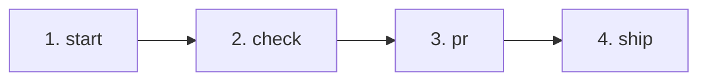

# GitHub Flow

Automate the full GitHub issue-to-production lifecycle through a unified CLI script (`scripts/flow.sh`) and standardized GitHub CLI/GraphQL patterns.

This skill connects three separate GitHub systems into a single seamless loop:
1. **Repository Git & PRs** (`git` + `gh pr`)
2. **Issue Tracking & Project Boards** (`gh project` + GitHub Projects v2)
3. **Continuous Deployment** (Cloudflare, Vercel, Netlify, or custom webhooks)

---
## Workflow Lifecycle



| Step | Command | What It Does |
|---|---|---|
| **1. Start** | `./scripts/flow.sh start <issue_no> [slug]` | Syncs default branch, sets Project board status to **In Progress**, and creates `feature/<slug>` branch. |
| **2. Check** | `./scripts/flow.sh check` | Runs project verification gates (typecheck, tests, build) and shows git status. |
| **3. PR** | `./scripts/flow.sh pr <issue_no> [title] [body]` | Commits changes, pushes branch, opens PR, and links PR to issue via GraphQL. |
| **Link** | `./scripts/flow.sh link <issue_no> <pr_no>` | Standalone command to link any PR to an issue via GraphQL. |
| **4. Ship** | `./scripts/flow.sh ship [pr_no]` | Squash-merges PR, deletes remote branch, syncs local default branch, marks board item **Done**, and triggers deployment webhook. |
| **Deploy** | `./scripts/flow.sh deploy` | Standalone trigger for the deployment webhook (`POST`). |
| **Status** | `./scripts/flow.sh status` | Displays active branch, associated PR, and project board link. |

---

## Configuration (`.flowrc`)

`github-flow` works zero-config on standard repos, but can be tailored per repository using a `.flowrc` file in the repository root.

```bash
# .flowrc

# GitHub Projects v2 Integration (Optional)
PROJECT_NUM="5"
PROJECT_OWNER="cemcakirlar"
STATUS_FIELD_NAME="Status"
STATUS_IN_PROGRESS_NAME="In Progress"
STATUS_DONE_NAME="Done"

# Quality Verification Gate (Optional)
# If omitted, flow.sh auto-detects from package.json, Makefile, or Cargo.toml
CHECK_CMD="pnpm -r --parallel run typecheck && pnpm build"

# Deployment Webhook (Optional)
# Triggered via POST on `ship` and `deploy`
DEPLOY_HOOK_URL="https://api.cloudflare.com/client/v4/workers/builds/deploy_hooks/YOUR_DEPLOY_HOOK_UUID"

# Branching Conventions (Optional)
DEFAULT_BRANCH="main"
BRANCH_PREFIX="feature/"
```

See `references/flowrc.example` for a complete template.

---

## Adopting in a New Repository

1. **Install or vendor the skill**: Ensure `github-flow` exists in your `.agents/skills/` directory.
2. **Add an alias (optional but recommended)**:
   In `package.json`:
   ```json
   "scripts": {
     "flow": "bash .agents/skills/github-flow/scripts/flow.sh"
   }
   ```
   Or execute directly: `bash .agents/skills/github-flow/scripts/flow.sh <command>`.
3. **Configure (optional)**: Create `.flowrc` if using GitHub Projects v2 boards or deploy hooks.
4. **Document in `AGENTS.md`**:
   ```markdown
   ## Issue workflow
   Use `pnpm flow` (`.agents/skills/github-flow/scripts/flow.sh`) for issue lifecycle:
   - `pnpm flow start <issue_no>`
   - `pnpm flow check`
   - `pnpm flow pr <issue_no> [title]`
   - `pnpm flow ship [pr_no]`
   ```
