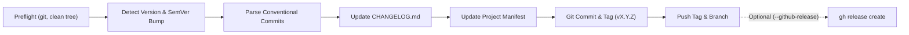

# GitHub Release (`github-release`)

Automate the full software release lifecycle through a unified, stack-agnostic CLI script (`scripts/release.sh`), Conventional Commits parsing, Keep a Changelog generation, git tagging, and GitHub Release publishing (`gh release create`).

---

## 1. Release Lifecycle



---

## 2. Command Reference

| Command / Option | What It Does |
| :--- | :--- |
| `release` (no args) | Displays help menu and exits without performing any actions. |
| `release init` | Initializes repository with `.releaserc`, starter `CHANGELOG.md`, and verifies permissions. |
| `release patch` | Bumps patch version (e.g. `0.1.0` ➔ `0.1.1`), updates changelog, commits, and pushes tag. |
| `release minor` | Bumps minor version (e.g. `0.1.0` ➔ `0.2.0`). |
| `release major` | Bumps major version (e.g. `0.1.0` ➔ `1.0.0`). |
| `release <X.Y.Z>` | Releases an explicit SemVer version (e.g. `1.2.0` or `1.0.0-rc.1`). |
| `--github-release`, `--gh-release` | Explicitly publishes a GitHub Release via `gh` CLI. By default, only the Git tag is pushed. |
| `--dry-run` | Simulates all steps without touching files, git history, or remotes. Works with both `init` and releases. |
| `--no-push` | Updates files, creates git commit and tag locally, but does not push to remote or create GitHub release. |
| `--notes-only` | Only parses commits since the last tag and outputs the markdown changelog notes to stdout. |
| `--skip-check` | Skips configured pre-release quality checks. |
| `--skip-build` | Skips configured build/packaging commands. |
| `--allow-dirty` | Allows running even if git working tree has uncommitted changes (useful for testing/dry-runs). |
| `--tag-prefix <pfx>` | Customizes tag prefix (default: `v`, e.g. `v1.0.0`). |

---

## 3. Step Chaining & Agent Rules (MANDATORY)

To keep engineering velocity high and workflows deterministic, agents should recommend the release action whenever changes on `main` are ready to be published:

### Workflow Transition

| Current State / Trigger | Recommended Action |
| :--- | :--- |
| First-time repository adoption / bootstrap | `pnpm release init --dry-run` (then `pnpm release init`) |
| Pull request merged to `main` via `github-flow` (`flow ship`) | `pnpm release patch --dry-run` (or `pnpm release patch`) |
| Preparing a new feature release | `pnpm release minor` |
| Preparing a breaking API change | `pnpm release major` |
| Inspecting unreleased changes | `pnpm release --notes-only` |

### AI Agent Reporting Requirement

Whenever an AI agent completes a release simulation or executes a release, **it MUST output the next command or verification link immediately below its summary report**:

````markdown
### Sonraki Adım / Next Step
```bash
pnpm release patch
```
````

---

## 4. Automatic Manifest Detection (Auto-Discovery)

The release engine automatically detects the project type and updates the corresponding version file:

1. **Node.js / TypeScript**: Updates `version` in `package.json` (uses `npm version --no-git-tag-version`).
2. **Rust**: Updates `version` in `Cargo.toml`.
3. **Python**: Updates `version` in `pyproject.toml`.
4. **macOS / Xcode**: Updates `MARKETING_VERSION` and increments `CURRENT_PROJECT_VERSION` in `*.pbxproj`.
5. **Generic Projects**: Updates `VERSION` file, or defaults to git tags only.

---

## 5. Configuration (`.releaserc`)

Optional `.releaserc` in the project root allows customization:

```bash
# .releaserc

# Verification gate to run before releasing
CHECK_CMD="pnpm flow check"

# Build/compile command to run before tagging
BUILD_CMD="pnpm build"

# Directory containing build artifacts to upload to GitHub Release
ASSETS_DIR="dist"

# Default branch (default: main)
DEFAULT_BRANCH="main"

# Tag prefix (default: v)
TAG_PREFIX="v"
```

---

## 6. Repository Bootstrap & Onboarding Guide

When bringing `github-release` into a repository for the first time, follow this standard procedure:

### Option A: Automated Initialization (Recommended)

Run `init` to automatically detect project configurations, create `.releaserc`, generate starter `CHANGELOG.md`, and verify permissions:

```bash
# 1. Preview changes safely without modifying files
pnpm release init --dry-run

# 2. Apply initialization
pnpm release init
```

### Option B: Manual Setup Checklist

If configuring manually or customizing before bootstrapping:

1. **Vendor or Install the Skill**:
   Ensure `.agents/skills/github-release/` is present in the repository.

2. **Add Script Alias**:
   - In `package.json` (Node.js):
     ```json
     "scripts": {
       "release": "bash .agents/skills/github-release/scripts/release.sh"
     }
     ```
   - In `Makefile` (Generic / Go / Rust):
     ```makefile
     release:
     	@bash .agents/skills/github-release/scripts/release.sh $(filter-out $@,$(MAKECMDGOALS))
     ```

3. **Ensure Script Permissions**:
   ```bash
   chmod +x .agents/skills/github-release/scripts/release.sh
   ```

4. **Create Configuration (`.releaserc`)**:
   Define verification gates and build commands tailored to your stack:
   ```bash
   # .releaserc
   CHECK_CMD="pnpm flow check"     # Pre-release validation (typecheck, test, build)
   BUILD_CMD="pnpm build"          # Build artifact command
   DEFAULT_BRANCH="main"           # Target production branch
   TAG_PREFIX="v"                  # Tag format (v1.0.0)
   ```

5. **Initialize `CHANGELOG.md`**:
   Create a root [CHANGELOG.md](file://CHANGELOG.md) following Keep a Changelog:
   ```markdown
   # Changelog

   All notable changes to this project will be documented in this file.

   The format is based on [Keep a Changelog](https://keepachangelog.com/en/1.1.0/),
   and this project adheres to [Semantic Versioning](https://semver.org/spec/v2.0.0.html).

   ## [Unreleased]

   ## [0.1.0] - 2026-10-01
   ### Added
   - Initial project release and automated release configuration.
   ```

6. **Clean Working Tree & Initial Commit**:
   Because `release.sh` enforces a clean git working tree, commit the newly added skill and release files to `main`:
   ```bash
   git add .agents/skills/github-release .releaserc CHANGELOG.md package.json AGENTS.md
   git commit -m "feat(release): configure github-release automation and changelog"
   ```

7. **Verify GitHub CLI & Permissions**:
   Confirm GitHub CLI is authenticated and has permission to push tags and create releases:
   ```bash
   gh auth status
   ```

8. **Test First Dry-Run**:
   Simulate the release to ensure SemVer calculation and changelog parsing succeed:
   ```bash
   pnpm release patch --dry-run
   ```
