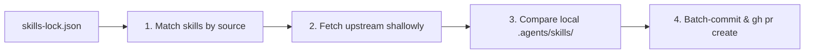

# Skills Upstream (`skills-upstream`)

Inspect drift between locally modified agent skills (`.agents/skills/`, `.claude/skills/`, etc.) and their upstream source repositories (`skills-lock.json`), and batch-create consolidated Pull Requests against upstream with all accumulated refinements.

---

## 1. Why `skills-upstream`?

When working inside a project that uses vendor skills:
1. **Local Drift Prevention**: Local fixes to skill scripts can be wiped out on `npx skills update` unless they are contributed back to upstream.
2. **Batching over Micro-PRs**: Group multiple skill refinements (e.g. fixes across `github-flow`, `github-cli`, etc.) into a **single cohesive upstream PR** instead of opening micro-PRs for every single edit.
3. **Decoupled & Machine-Agnostic**: Reads `skills-lock.json` directly to resolve upstream remotes via GitHub CLI (`gh`). Automatically handles both direct repository pushes and community fork workflows.

---

## 2. Commands & Workflow

| Command | Action |
| :--- | :--- |
| `status`, `check` | Scans installed skills in `skills-lock.json` and displays a drift table (In sync vs Modified). |
| `diff` | Shows unified colorized diffs for all modified skills against upstream. |
| `pr [title] [body]` | Collects all modified skills, creates an upstream branch, and opens a single Pull Request. |
| `sources` | Lists all upstream repositories tracked in the lockfile with their skill counts. |

### Options

- `-s, --source <repo>`: Target a specific upstream repository (e.g. `cemcakirlar/skills`). **Strictly required for `pr`** to prevent accidental pushes.
- `-k, --skill <name>`: Target a specific skill only (e.g. `github-flow`), leaving other modified skills untouched.
- `-y, --yes`: Auto-confirm PR creation without interactive prompt.
- `-l, --lock <path>`: Specify a custom lockfile path (auto-detects `skills-lock.json`, `.skill-lock.json`, `.agents/.skill-lock.json`).
- `-g, --global`: Inspect global agent skills (`~/.agents/.skill-lock.json`). Required to inspect global skills; commands will never fall back to global automatically when a project lockfile is absent.

### Usage Examples

```bash
# Check drift against all detected upstream sources
./scripts/upstream.sh status

# Target a specific upstream repository
./scripts/upstream.sh status --source cemcakirlar/skills

# Target a single skill only
./scripts/upstream.sh diff --skill github-flow

# Open a consolidated Pull Request on upstream repo with explicit target
./scripts/upstream.sh pr --source cemcakirlar/skills --skill github-flow "feat(skills): sync workflow improvements from my-project"
```

---

## 3. How It Works



1. **Manifest-Driven & Nested Structure Aware**: Reads `skills-lock.json` in the project root to discover upstream repositories (`source`) and exact relative locations via `skillPath`. Accurately resolves flat, 1-level, or multi-level nested skill repositories (e.g. `skills/engineering/grill-with-docs`).
2. **Ephemeral Clone**: Clones a shallow, temporary copy of the target upstream repository to perform fast `diff` comparisons.
3. **Multi-Skill Bundling & Filtering**: Gathers modified files across skills originating from that upstream repository, or strictly narrows down to a specific skill via `--skill`.
4. **Safety & Explicit Confirmation**: Never pushes silently. Requires selecting target source when multiple repositories exist, displays a full PR plan, and asks for interactive confirmation before any branch is pushed.
5. **Clean Contribution**: Automatically handles direct push for repo owners and fork-based pull requests for open-source contributors via GitHub CLI (`gh`).
